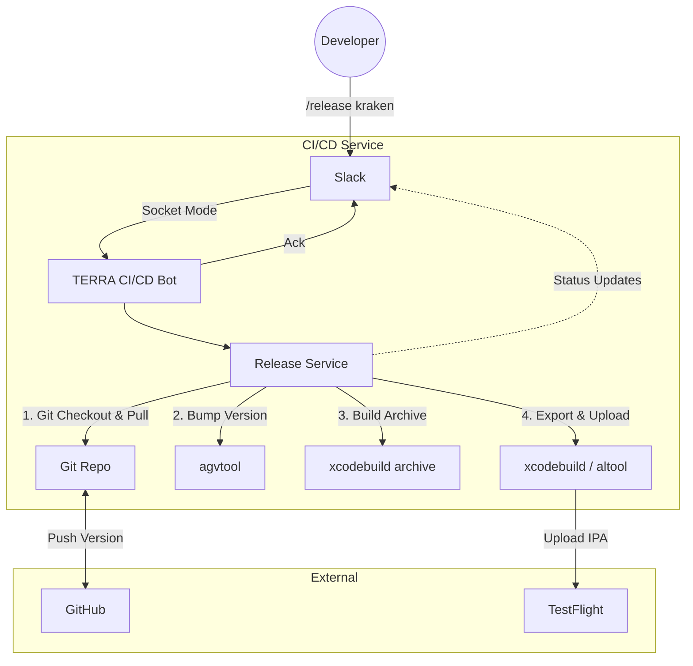

# TERRA CI/CD Automation

This repository hosts a Slack-based CI/CD bot designed to automate the release process for Terra Charge mobile applications (iOS). It leverages `xcrun agvtool` for versioning and `xcodebuild` for archiving and uploading builds to TestFlight.

## 🏗 Architecture

The system follows a simple event-driven architecture powered by Slack Bolt (Socket Mode).



## 🎨 Bot Personality

The bot is designed to be engaging and visual:

### Dynamic Icons
The bot changes its avatar and emoji indicators based on the environment being released:
*   **Kraken**: Uses `:kraken:` 🐙
*   **Titan**: Uses `:titan:` 🤖
*   **Other**: Uses `:rocket:` 🚀

> **Note:** Requires `chat:write.customize` scope in Slack App settings to enable dynamic avatar changing.

### Animated Status
*   **Waiting**: Displays random "waiting" GIFs (e.g., Mr. Bean, Spongebob) during the long build/archive process to make the wait feel shorter.
*   **Success**: Celebrates successful releases with random "party/success" GIFs attached to the final completion message.

## 🚀 Setup & Installation

### Prerequisites
*   Node.js (v18+)
*   Xcode (v15+)
*   Git configured with SSH or HTTPS credentials.
*   **Slack App** configured with Socket Mode and Slash Commands.

### Configuration
1.  Clone this repository.
2.  Copy `.env.example` to `.env`:
    ```bash
    cp .env.example .env
    ```
3.  Fill in the required variables:
    ```env
    # Slack Credentials
    SLACK_BOT_TOKEN=xoxb-...
    SLACK_APP_TOKEN=xapp-...
    SLACK_SIGNING_SECRET=...

    # Project Path (Absolute path to your iOS project folder containing .xcodeproj)
    PROJECT_ROOT=/Users/yourname/TMC_Mobile_JP/iosApp

    # Release Branches
    RELEASE_BRANCH_KRAKEN=develop  # or your specific release branch
    RELEASE_BRANCH_TITAN=main
    
    # App Store Connect (Optional - for API Key Upload)
    APP_STORE_CONNECT_API_KEY_ID=...
    APP_STORE_CONNECT_ISSUER_ID=...
    ```

### Running the Bot
```bash
# Install dependencies
npm install

# Start the bot
npm start

# For development (hot reload)
npm run dev
```

## 🤖 Usage

In any Slack channel where the bot is invited:

```slack
/release <environment> [version] [build_number]
```

**Examples:**

*   **Standard Release:**
    ```slack
    /release kraken 2.5.0 10
    ```
    *Effect: Bumps to version 2.5.0 (Build 10), commits/pushes to git, builds, and uploads to TestFlight. Shows Kraken icon.*

*   **Auto-Increment Build:**
    ```slack
    /release titan 2.4.1
    ```
    *Effect: Bumps to 2.4.1 and auto-increments the build number based on current count. Shows Titan/Robot icon.*

## 📂 Project Structure

```
├── src
│   ├── adapters       # Interfaces with external tools (Slack)
│   ├── domain         # Types and Interfaces
│   ├── services       # Core business logic (ReleaseService)
│   ├── config.ts      # Configuration loader
│   └── index.ts       # Entry point
├── .env.example       # Template for environment variables
├── package.json       # Dependencies
└── tsconfig.json      # TypeScript configuration
```
